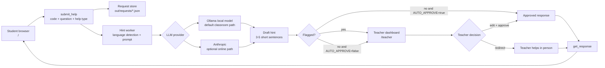

# microbit-agent

Human-in-the-loop help desk for kids working on BBC micro:bit projects.

Kids paste their MicroPython or JavaScript/MakeCode-style code and ask a question. An LLM (local Ollama by default, or Anthropic) generates a kid-friendly hint. The teacher reviews and approves the hint before the student sees it (or auto-approve can be enabled for faster testing).

## Aim

This project is for classrooms where students need timely coding help, but should not be pushed into blindly pasting code into ChatGPT and copying the answer back into their project.

The goal is to make LLM assistance behave like a classroom support tool:

- students ask for a small hint about their own micro:bit code
- the model runs locally by default through Ollama, so the normal path does not depend on paid cloud AI
- the response is short, age-appropriate, and framed as one next step rather than a finished solution
- the teacher stays in the loop, can edit or reject the hint, and can step in directly when needed
- every request is saved as a simple JSON record so the class workflow is inspectable

This follows the same pattern as the GB Studio, Minecraft MCP, Mindstorms, and SNES Studio work: expose a narrow local tool surface, keep state on disk, prefer stable workflows over raw chat output, and let an agent help with a real creative or educational task without becoming the unchecked source of truth.

## Related Experiments

This repository is one part of a broader set of experiments in useful educational agents:

- [`microbit-mcp`](https://github.com/eoinjordan/microbit-mcp): companion MCP server for micro:bit CODAL firmware projects, MakeCode TypeScript workflows, source read/write, validation, and build tooling
- `GB Studio` / `gb-studio-agent`: agent tools for inventorying and safely patching game projects instead of free-form editing
- `minecraft-mcp`: local-first planning, state, and behavior-pack delivery so agents create repeatable world-building workflows rather than one-off chat snippets
- `mindstorms-robot-creator` / `lego-mindstorms-mcp`: human-supervised robot building and debugging where agents propose one small test, record observations, and keep physical safety visible
- `SNES Studio`: kid-friendly game creation where helpers propose reviewable patches, validate projects, and prepare export/build workflows without silently changing the game

The shared idea is not "AI writes the project." The shared idea is that an LLM can sit behind a small, inspectable workflow that helps a learner, parent, mentor, or teacher make the next good move.

## Workflow

```
Student submits code + question
        ↓
LLM generates hint (async)
        ↓
Teacher reviews → edits → approves / redirects
        ↓
Student's browser shows the approved hint
```

## Architecture



The important design choice is the review gate. The LLM drafts a hint, but the teacher owns what reaches the student unless `AUTO_APPROVE` is deliberately enabled for testing or a trusted small-group setup.

`server.js` contains four deliberately small layers:

- HTTP UI: student page, teacher dashboard, `/health`, and `/run`
- request persistence: one JSON file per help request under `out/requests/`
- LLM worker: asynchronous prompt generation with JavaScript/MakeCode vs MicroPython detection
- review workflow: teacher approval, redirect, or optional auto-approval for non-flagged hints

The classroom flow is local-first. The student and teacher browsers talk to the same local server, the default model call goes to Ollama on `127.0.0.1:11434`, and the saved request files provide a simple audit trail of what happened.

Compared with an open chat window, this is intentionally constrained. It asks for one hint, keeps the teacher visible, stores the interaction, and keeps the assistance tied to the student's submitted code rather than encouraging a full generated answer.

## Blocks And IDE Direction

The UI supports both code and a small Blockly surface for MakeCode-style micro:bit JavaScript. Students can paste code, render common patterns as blocks, or build a small block sketch and turn it back into code before asking for help. Teachers see the submitted code and a read-only block preview, so the same request can be reviewed in the representation a learner understands.

This is deliberately a small local prototype rather than a full MakeCode fork. The intended contribution path is:

- prove the classroom flow outside the main editor first
- keep the help protocol simple: code, blocks/code representation, question, draft hint, teacher decision
- reuse Blockly concepts that map naturally to MakeCode blocks
- keep the LLM behind a review gate so it acts like assisted feedback, not an unchecked code generator
- later move the same flow into the micro:bit editor, or ship a standalone fork for schools that want local Ollama and teacher review built in


Hint comes back once approved by the teacher:


## URLs

| URL | Who uses it |
|-----|-------------|
| `http://localhost:3097/` | Students |
| `http://localhost:3097/teacher` | Teachers |
| `http://localhost:3097/health` | Status check |

## Quickstart

```bash
cp .env.example .env
# edit .env — set LLM_PROVIDER and matching keys
node server.js
```

## LLM options

### Offline (Ollama — classroom default)

```env
LLM_PROVIDER=ollama
OLLAMA_URL=http://127.0.0.1:11434
OLLAMA_MODEL=qwen2.5-coder:7b
```

Pull the model once:
```bash
ollama pull qwen2.5-coder:7b
```

Any Ollama model works. `llama3.2:3b` is lighter; `qwen2.5-coder:7b` gives better code hints.

### Online (Anthropic)

```env
LLM_PROVIDER=anthropic
ANTHROPIC_API_KEY=sk-ant-...
ANTHROPIC_MODEL=claude-haiku-4-5-20251001
```

## Docker

```bash
docker compose up -d
```

The `out/requests/` directory is volume-mounted so requests survive restarts.

On a Pi with Ollama running on the same host, set `OLLAMA_URL=http://host.docker.internal:11434`.

## API

All actions via `POST /run`:

```json
{ "action": "submit_help", "params": { "studentName": "Alex", "code": "from microbit import *\n...", "question": "My LED won't light up", "helpType": "debug" } }
```

```json
{ "action": "list_requests", "params": {} }
```

```json
{ "action": "get_request", "params": { "id": "<uuid>" } }
```

```json
{ "action": "review_request", "params": { "id": "<uuid>", "decision": "approve", "editedResponse": "...", "teacherNote": "..." } }
```

```json
{ "action": "get_response", "params": { "id": "<uuid>" } }
```

## Request states

| Status | Meaning |
|--------|---------|
| `queued` | Just submitted, LLM call starting |
| `pending_llm` | LLM is generating the hint |
| `pending_review` | Hint ready, waiting for teacher |
| `approved` | Teacher approved, student can see it |
| `rejected` | Teacher redirected student to themselves |
| `llm_error` | LLM failed, teacher writes hint manually |

## Environment

| Variable | Default | Description |
|----------|---------|-------------|
| `PORT` | `3097` | Server port |
| `HOST` | `0.0.0.0` | Bind address |
| `LLM_PROVIDER` | `ollama` | `ollama` or `anthropic` |
| `OLLAMA_URL` | `http://127.0.0.1:11434` | Ollama base URL |
| `OLLAMA_MODEL` | `qwen2.5-coder:7b` | Ollama model name |
| `ANTHROPIC_API_KEY` | — | Required when `LLM_PROVIDER=anthropic` |
| `ANTHROPIC_MODEL` | `claude-haiku-4-5-20251001` | Anthropic model |
| `LLM_TIMEOUT_MS` | `90000` | LLM call timeout |
| `AUTO_APPROVE` | `false` | When `true`, non-flagged LLM hints are automatically approved and sent to students |
